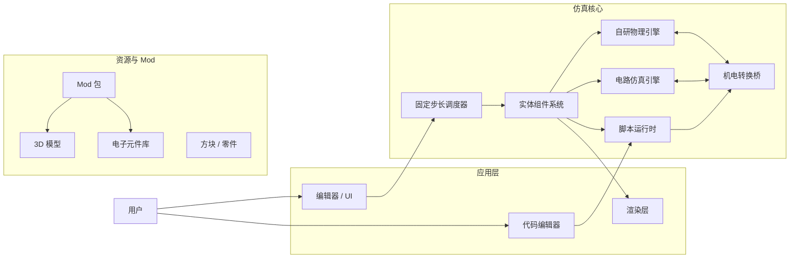

# SRPlatform 总体架构

## 1. 设计原则

1. **统一物理单位**：内部使用 SI 单位，例如米、千克、秒、安培、伏特、牛顿。避免 Minecraft 风格的“方块单位”直接进入物理核心。
2. **固定步长仿真**：物理和电路都按固定时间步推进，渲染只负责展示。这样结果更稳定，也便于做教学回放。
3. **仿真与渲染分离**：物理、电路、脚本构成仿真核心；画面、编辑器、UI 是可替换的展示层。
4. **一切皆可观测**：电流、电压、受力、速度、传感器值都应能记录成时间序列，用于调试和教学。
5. **Mod 优先**：车辆、无人机、电路板、元件、脚本都是可加载资源，而不是硬编码进引擎。

## 2. 总体结构



## 3. 核心模块

### 3.1 固定步长调度器

- 每个仿真步按固定 `dt` 推进。
- 顺序大致为：处理输入 -> 脚本 -> 电路 -> 机电转换 -> 物理 -> 状态更新 -> 记录数据。
- 渲染帧与仿真步解耦，必要时使用插值展示。

### 3.2 实体组件系统

- 世界里的车辆、电机、轮子、电池、电路节点都是实体。
- 组件描述数据，系统描述行为。
- 好处是用户自定义物体不需要改引擎源码。

### 3.3 自研物理引擎

早期只做刚体，后续再扩展：

- 刚体动力学：质量、惯性张量、线速度、角速度。
- 碰撞形状：盒、球、圆柱、凸包、三角网格。
- 宽相检测：BVH 或 Sweep and Prune。
- 窄相检测：SAT、GJK/EPA。
- 接触求解：碰撞、摩擦、恢复系数。
- 约束：铰链、滑动、轮子约束、电机约束。
- 无人机相关：简化升力、阻力、螺旋桨推力、扭矩。

物理引擎对外暴露的是能力接口，例如 `step(dt)`、`add_body`、`add_joint`、`query`。内部算法可以持续替换，不影响上层。

### 3.4 电路仿真引擎

支持两层仿真：

- **模拟电路**：电阻、电容、电感、二极管、晶体管、电压源、电流源等，使用改进节点分析加牛顿迭代求解。
- **数字逻辑**：门电路、触发器、PWM 输出、常见 MCU 引脚。

电路和物理一样使用固定步长。对于开关电源、电机 PWM 这类高频问题，电路子步长可以比物理步长更小。

#### 3.4.1 电路数据模型

- 电路拓扑由节点、元件和端口组成，`CircuitModel` 负责创建和连接这些对象。
- 节点使用稳定的 `NodeId`，其中 `kGroundNodeId` 固定为接地节点。
- 每个元件用 `ComponentDefinition` 描述类型、名称、端口名和参数；参数采用类型安全的 `std::variant`。
- 每个端口有独立 `PortId`，并记录它所属元件和当前连接的节点。

#### 3.4.2 直流节点分析

- 直流求解器使用改进节点分析，未知量为非接地节点电压和电压源/电感支路电流。
- 支持电阻、独立电压源、独立电流源、电容和电感；直流工作点下电容视为开路，电感视为短路。
- 所有节点电压相对接地节点，元件支路电流统一取端口 `port[0]` 到 `port[1]` 为参考方向。
- 求解器遇到浮空节点、断开的端口、非正电阻或奇异矩阵时返回失败，不给出虚假结果。

#### 3.4.3 瞬态分析

- 瞬态求解器使用固定步长和隐式欧拉法，适合 RC、RL 和 RLC 电路。
- 电容、电感在初始时刻分别按给定初值和初始电流建立工作点，后续每步用伴随模型离散化。
- 输出每个采样时刻的节点电压和元件电流，供波形显示和后续机电桥使用。

### 3.5 机电转换桥

这是本平台最重要的模块，用来连接电路和机械世界：

- 电池提供电压，电机消耗电流并输出扭矩。
- 电机转速产生反电动势，影响电流。
- 舵机把目标角度映射成约束或力矩。
- 传感器把机械状态转换为电压、频率、数字信号。
- 编码器、IMU、距离传感器、电流传感器都在这一层接入。

### 3.6 脚本运行时

用户代码不直接操作物理对象，而是通过受控 API：

- 读传感器值。
- 设置电机、舵机、继电器等执行器。
- 获取当前时间步和仿真状态。
- 支持热重载，方便调试。

推荐脚本语言考虑 Lua 或 Rhai；如果用户更熟悉 Python，可提供受控的 Python 嵌入式运行时。核心原则是脚本运行必须可暂停、可恢复、可限时，避免卡死整个仿真。

### 3.7 Mod 与资源系统

一个 Mod 包可以包含：

- 3D 模型和材质。
- 电路原理图或网表。
- 元件定义。
- 脚本。
- 实体蓝图，例如“一辆四轮小车”或“一台四旋翼无人机”。

资源格式早期可以直接使用 JSON + GLTF + 自定义电路描述，后续再考虑兼容 KiCad、SPICE 网表等。

### 3.8 编辑器与 UI

编辑器分阶段实现：

- 场景编辑：放置地面、车辆、无人机。
- 电路编辑：放置元件、连线、查看节点电压。
- 脚本编辑：内置代码编辑器和运行日志。
- 观测面板：波形图、传感器读数、受力与能耗。

## 4. 关键接口草案

为了保持模块可替换，建议先定义好接口，而不是从具体实现写起：

```text
PhysicsWorld
  step(dt)
  add_body(definition)
  add_joint(definition)
  query(region)

CircuitWorld
  step(dt)
  add_component(definition)
  connect(a, b)
  get_node_voltage(id)
  get_component_current(id)

ActuatorBus
  set_motor(id, value)
  set_servo(id, angle)

SensorBus
  read_sensor(id) -> value

ScriptHost
  load(script_id)
  run_once(dt)
  reload(script_id)
```

## 5. 技术栈

项目已确定使用 C++20。

- 构建系统：CMake 3.24+
- 包管理：vcpkg manifest mode，当前依赖暂由 CMake FetchContent 拉取，待 vcpkg 安装后迁移
- 数学库：GLM
- ECS：EnTT
- 渲染：GLFW + OpenGL 4.6 起步，Dear ImGui 做工具 UI，渲染层通过接口隔离
- 模型导入：Assimp / tinygltf，GLTF 为第一优先格式
- 序列化：nlohmann/json
- 脚本：Lua 5.4 + sol2
- 日志：spdlog
- 测试：GoogleTest
- 格式化与静态检查：clang-format、clang-tidy

完整工程规范见 [项目规范](project-specification.md)。
